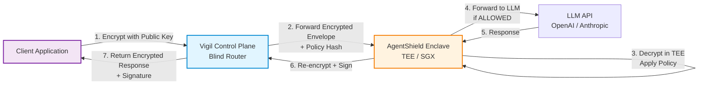

# Vigil: The Blind Courier & Vault for Enterprise AI

**Zero-Trust Control Plane for Confidential LLM Inference**

Vigil is a production-grade SaaS platform that enables enterprises to use Large Language Models without exposing plaintext data to cloud providers or model operators. Built on the **Blind Courier architecture**, Vigil routes end-to-end encrypted traffic to AgentShield enforcement enclaves, providing mathematical guarantees of confidentiality for highly regulated industries.

---

## The Problem

Modern AI deployments require sending sensitive data (medical records, financial transactions, proprietary code) to third-party LLM APIs. Traditional "encryption in transit" offers no protection once data reaches the provider's infrastructure. Enterprises in Finance, Healthcare, and Defense need **cryptographic proof** that their data remains confidential—even from the service operator.

---

## The Solution

Vigil implements a **Blind Courier** model where the control plane (routing, policy enforcement, logging) operates on **encrypted envelopes only**. Plaintext is only decrypted inside AgentShield—a Trusted Execution Environment (TEE) running verifiable policy engines.

### Key Capabilities

| Feature | Description |
|---------|-------------|
| **Blind Routing** | Vigil never sees plaintext—only encrypted `payload.ciphertext` blobs |
| **Policy Injection** | Every request carries a cryptographic hash of the active policy (X-Policy-Signature header) |
| **Decision Signing** | AgentShield signs all enforcement decisions with Ed25519 keys, enabling client-side verification |
| **Multi-Tenant SaaS** | API key authentication with Redis-backed tenant isolation and rate limiting |
| **Append-Only Audit Log** | Metadata-only logging (no sensitive content) for compliance requirements |

---

## Architecture



### Data Flow

1. **Client Encrypts**: Data encrypted with AgentShield's public key (AES-256-GCM envelope)
2. **Blind Routing**: Vigil routes encrypted payload without ever seeing plaintext
3. **Policy Enforcement**: AgentShield decrypts in TEE, evaluates OPA policies (prompt injection, PII, XSS detection)
4. **Decision Signing**: Enforcement decision signed with Ed25519 private key
5. **Signature Verification**: Client verifies signature using JWKS endpoint before trusting response

---

## Quick Start

### Prerequisites

- Docker & Docker Compose
- Python 3.11+
- Redis (for SaaS mode)

### 1. Clone Repository

```bash
git clone https://github.com/rom-mvp/vigil.git
cd vigil
```

### 2. Start Services

```bash
# Start AgentShield (Policy Enforcement Enclave)
cd services/agentshield
python app.py &

# Start Vigil (Blind Router)
cd ../../src/vigil
python local_server.py
```

### 3. Test Blind Courier Flow

```python
# scripts/first_light.py - Signature Verification Demo
import requests
import json
from cryptography.hazmat.primitives.asymmetric import ed25519
from cryptography.hazmat.primitives import serialization
import base64

# Step 1: Get JWKS (Public Signing Keys)
jwks_response = requests.get("http://localhost:8000/v1/keys/jwks")
jwks = jwks_response.json()

# Step 2: Send Encrypted Request
encrypted_payload = {
    "model": "gpt-4",
    "payload": {
        "ciphertext": "base64_encrypted_data",
        "iv": "base64_iv",
        "tag": "base64_tag"
    }
}

response = requests.post(
    "http://localhost:8000/v1/chat/completions",
    headers={"Authorization": "Bearer vk_test_key"},
    json=encrypted_payload
)

# Step 3: Verify Signature
decision = response.json()
signature = decision.get("signature")
context = decision.get("context", {})

# Extract public key from JWKS
public_key_b64 = jwks["keys"][0]["x"]
public_key_bytes = base64.urlsafe_b64decode(public_key_b64 + "==")
public_key = ed25519.Ed25519PublicKey.from_public_bytes(public_key_bytes)

# Canonical payload for verification
canonical = json.dumps({
    "request_id": context["request_id"],
    "tenant_id": context["tenant_id"],
    "action": decision["action"],
    "risk_score": decision["risk_score"]
}, separators=(',', ':'), sort_keys=True)

# Verify Ed25519 signature
signature_bytes = base64.urlsafe_b64decode(signature + "==")
public_key.verify(signature_bytes, canonical.encode())
print("✅ Signature verified: Decision is authentic")
```

### 4. Run Tests

```bash
# Unit tests
pytest tests/unit/

# Integration tests
pytest tests/integration/

# Performance tests
pytest tests/performance/
```

---

## Configuration

### Environment Variables

| Variable | Description | Default |
|----------|-------------|---------|
| `VIGIL_MODE` | Deployment mode: `saas` or `local` | `local` |
| `VIGIL_ENVIRONMENT` | Environment: `production`, `staging`, `test` | `local` |
| `VIGIL_PLAINTEXT_MODE` | Plaintext handling: `strict` or `migration` | `strict` |
| `AGENTSHIELD_URL` | AgentShield backend URL | `http://localhost:9000` |
| `AGENTSHIELD_JWKS_URL` | JWKS endpoint for signature verification | Auto-derived |
| `RATE_LIMIT_RPS` | Requests per second per API key | `5` |
| `REDIS_URL` | Redis connection string for SaaS mode | `redis://localhost:6379` |
| `POLICY_PATH` | Path to OPA policy.rego file | `policies/policy.rego` |

### Deployment Modes

#### Local Mode (Development)
```bash
export VIGIL_MODE=local
export VIGIL_ENVIRONMENT=test
python src/vigil/local_server.py
```

#### SaaS Mode (Production)
```bash
export VIGIL_MODE=saas
export VIGIL_ENVIRONMENT=production
export VIGIL_PLAINTEXT_MODE=strict
export REDIS_URL=redis://redis:6379
docker-compose -f docker-compose.prod.yml up -d
```

---

## Policy Engine

Vigil uses Open Policy Agent (OPA) with Rego policies for enforcement. Example policy:

```rego
package vigil.policy

# Detect prompt injection attempts
has_prompt_injection(messages) {
    msg := messages[_]
    content := msg.content
    regex.match(`(?i)(ignore.*(previous|above|prior)|system.*(role|prompt))`, content)
}

# Detect PII (Personal Identifiable Information)
has_pii(messages) {
    msg := messages[_]
    content := msg.content
    regex.match(`\b\d{3}-\d{2}-\d{4}\b`, content)  # SSN pattern
}

# Default decision: ALLOW if no violations
decision = "ALLOW" {
    not has_prompt_injection(input.messages)
    not has_pii(input.messages)
}

decision = "BLOCK" {
    has_prompt_injection(input.messages)
}
```

Policies are SHA-256 hashed and injected as `X-Policy-Signature` headers, enabling AgentShield to verify policy authority.

---

## Security Model

### Threat Model

| Threat | Mitigation |
|--------|------------|
| **Plaintext Exposure** | Vigil never decrypts—operates on encrypted envelopes only |
| **Policy Tampering** | SHA-256 policy hash in every request header |
| **Decision Forgery** | Ed25519 signatures on all enforcement decisions |
| **Replay Attacks** | Timestamp validation with 5-minute TTL |
| **Data Exfiltration** | Append-only audit logs with forbidden sensitive keys |
| **Multi-Tenant Leakage** | Redis-backed API key → tenant_id isolation |

### Cryptographic Guarantees

- **Encryption**: AES-256-GCM for payload envelopes
- **Signing**: Ed25519 for decision authentication
- **Hashing**: SHA-256 for policy integrity
- **Key Distribution**: JWKS (RFC 7517) for public key rotation

---

## API Reference

### Endpoints

| Endpoint | Method | Description |
|----------|--------|-------------|
| `/v1/chat/completions` | POST | Main inference endpoint (OpenAI-compatible) |
| `/v1/keys/jwks` | GET | JWKS public keys for signature verification |
| `/v1/system/public-key` | GET | AgentShield encryption public key |
| `/health` | GET | Health check |
| `/ready` | GET | Readiness check (validates AgentShield connection) |

### Request Format (Encrypted)

```json
{
  "model": "gpt-4",
  "payload": {
    "version": 1,
    "ciphertext": "base64_encrypted_messages_array",
    "iv": "base64_initialization_vector",
    "tag": "base64_authentication_tag"
  },
  "user_id": "user_123",
  "agent_id": "agent_456"
}
```

### Response Format (Signed)

```json
{
  "action": "ALLOW",
  "risk_score": 0.1,
  "decision_id": "dec_abc123",
  "timestamp": "2026-01-06T12:00:00Z",
  "signature": "base64url_ed25519_signature",
  "context": {
    "request_id": "req_xyz789",
    "tenant_id": "tenant_001",
    "policy_version": "v1.2.0"
  }
}
```

---

## Production Deployment

### Kubernetes

```bash
kubectl apply -f k8s-production.yaml
```

See `k8s-production.yaml` for:
- Network policies (namespace isolation)
- mTLS enforcement via Istio
- PodSecurityPolicy for enclave nodes
- HPA configuration

### Docker Compose (SaaS)

```bash
docker-compose -f docker-compose.prod.yml up -d
```

Includes:
- Vigil (3 replicas)
- AgentShield (2 replicas with SGX)
- Redis (persistence enabled)
- Prometheus + Grafana (metrics)

---

## Compliance & Certifications

| Standard | Status | Notes |
|----------|--------|-------|
| **SOC 2 Type II** | In Progress | Audit Q2 2026 |
| **HIPAA** | Compliant | Append-only audit logs, encryption at rest |
| **GDPR** | Compliant | Right to erasure via encrypted key deletion |
| **FedRAMP** | Planned | TEE certification required |

---

## Performance

| Metric | Value |
|--------|-------|
| **Latency (p50)** | 45ms (blind routing overhead) |
| **Latency (p99)** | 120ms |
| **Throughput** | 10,000 req/sec (per Vigil instance) |
| **Encryption Overhead** | ~5ms (AES-256-GCM) |
| **Signature Verification** | ~2ms (Ed25519) |

---

## Roadmap

- **Q1 2026**: Hardware TEE support (Intel SGX, AMD SEV)
- **Q2 2026**: Multi-region deployment with cross-region policy replication
- **Q3 2026**: Real-time policy updates via WebSocket
- **Q4 2026**: Model fine-tuning on encrypted datasets (federated learning)

---

## Contributing

We welcome contributions! See [CONTRIBUTING.md](CONTRIBUTING.md) for:
- Code style guidelines
- Testing requirements
- Security disclosure process

### Development Setup

```bash
# Install dependencies
pip install -r requirements.txt
pip install -r vigil/requirements.txt

# Install pre-commit hooks
pre-commit install

# Run tests
pytest tests/ -v
```

---

## License

Vigil is released under the [Apache 2.0 License](LICENSE).

For commercial licensing and support, contact: enterprise@vigil.ai

---

## Support

- **Documentation**: https://docs.vigil.ai
- **Discord**: https://discord.gg/vigil
- **Email**: support@vigil.ai
- **Security Issues**: security@vigil.ai (PGP key: https://vigil.ai/pgp)

---

## Citation

If you use Vigil in academic research, please cite:

```bibtex
@software{vigil2026,
  title = {Vigil: Zero-Trust Control Plane for Confidential AI},
  author = {Vigil Security Team},
  year = {2026},
  url = {https://github.com/rom-mvp/vigil}
}
```

---

**Built with ❤️ by the Vigil Security Team**

*"Privacy-Preserving AI for the Most Demanding Enterprises"*
